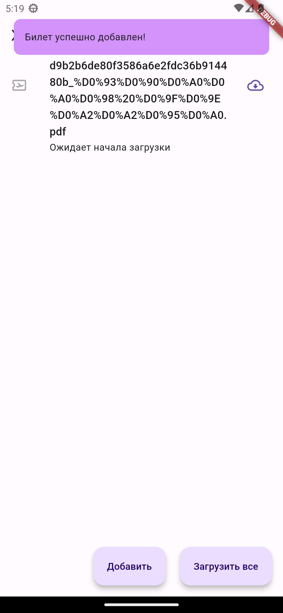

# Целевая платформа

Android

# Результаты

- Полностью готовый UI, как требовалось в задании.
- Присутствует валидация URL.
- FAB'ы скрываются, если достигнут конец списка при скролле.
- Файлы загружаются через dio
- Все обязательные пункты выполнены

# Ссылки на демонстрацию работы/скриншоты

  
  

  
  

  
  

